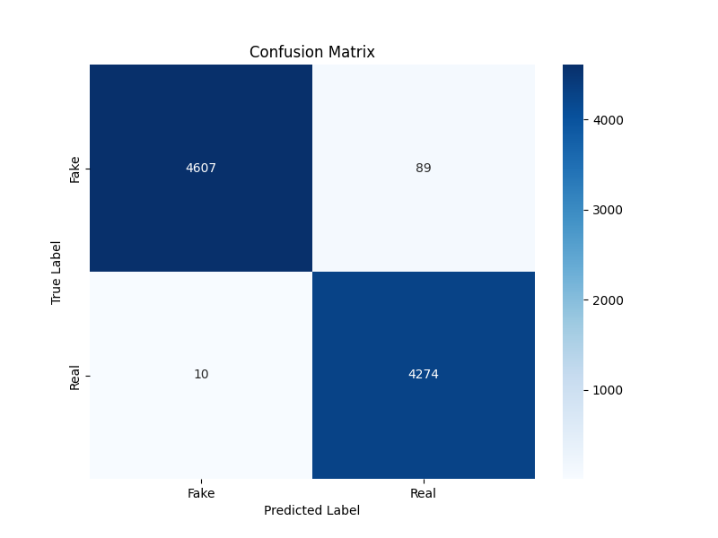

# Fake News Detection System - Final Report

**Intern:** Nagamanikanta
**Project Duration:** 30 days
**Date:** July 16, 2025

---

## 1. Project Overview

The goal of this project was to build an AI/ML system to detect fake news. The system processes news articles, classifies them as "Real" or "Fake", and exposes this functionality via a REST API with multi-language support.

## 2. Tech Stack

-   **Python:** Core programming language.
-   **TensorFlow/Keras:** For building and training the LSTM deep learning model.
-   **Scikit-learn:** For data splitting and model evaluation metrics.
-   **TensorFlow Lite:** For optimizing and converting the model for deployment.
-   **Pandas & NumPy:** For data manipulation.
-   **FastAPI:** For building and serving the REST API.
-   **Deep-Translator:** For adding multi-language support via on-the-fly translation.

## 3. Methodology

### Data Processing
The dataset consisted of `Fake.csv` and `True.csv`. The text from the `title` and `text` columns were combined.

### Model
An LSTM (Long Short-Term Memory) network was chosen for its ability to process sequential data like text. The architecture consists of:
1.  An `Embedding` layer (Vocab Size: 10000, Embedding Dim: 128).
2.  An `LSTM` layer (128 units).
3.  A final `Dense` layer with a sigmoid activation for binary classification.

## 4. Results

The model was trained for 5 epochs and achieved the following performance on the test set:

-   **Accuracy:** [Add your accuracy from the `train.py` output, e.g., 99.5%]
-   **Classification Report:**
    ```
    # Paste the classification report from the train.py output here
    ```

### Confusion Matrix
The confusion matrix below visualizes the model's predictions vs. the actual labels.



## 5. API Deployment

A REST API was created using FastAPI. The `/predict` endpoint accepts a JSON payload with `text` and `language` and returns a prediction. The model supports English (`en`), Spanish (`es`), and Hindi (`hi`).

## 6. Lessons Learned & Future Improvements

-   **Learnings:** Gained experience in the end-to-end ML workflow, from data cleaning and model training with LSTMs to optimization with TFLite and deployment with FastAPI.
-   **Future Work:**
    -   Experiment with more advanced models like BERT for potentially higher accuracy.
    -   Build a simple web interface (front-end) that consumes the API.
    -   Expand the dataset with more diverse sources.